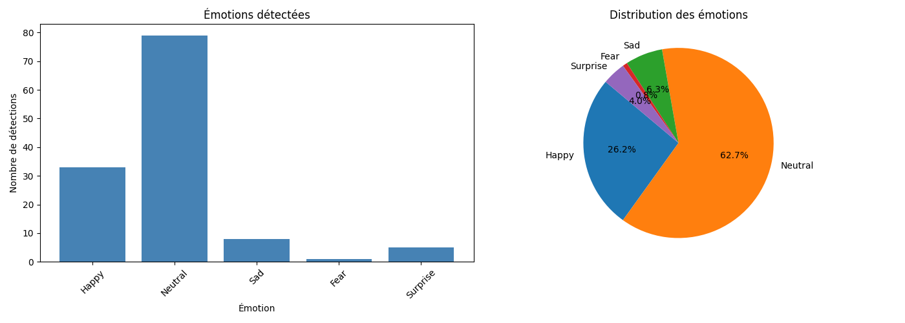

# 🎭 Emotion Detection Project

Ce projet utilise des réseaux de neurones convolutionnels (CNN) pour détecter et classifier les émotions humaines en temps réel via une webcam ou à partir d'images.

## 📝 Description du projet
Le système repose sur un modèle d'Intelligence Artificielle entraîné sur le dataset **FER2013**. Il est capable de reconnaître sept émotions fondamentales :
- Colère (Angry)
- Dégoût (Disgust)
- Peur (Fear)
- Joie (Happy)
- Triste (Sad)
- Surprise (Surprise)
- Neutre (Neutral)

L'application utilise **OpenCV** pour la capture vidéo, **MediaPipe** pour la détection précise des visages (landmarks), et **TensorFlow/Keras** pour la classification des émotions.

## 🚀 Contenu technique
- `camera_emotion.py` : Script principal pour lancer la détection en temps réel via webcam.
- `fer2013_emotion_model.h5` : Le modèle d'IA pré-entraîné utilisé pour la prédiction.
- `utils/` : Dossier contenant les scripts de prétraitement des images.
- `.gitignore` : Configuration pour exclure les fichiers inutiles (comme les dossiers de cache).

## 📊 Résultats et Analyses
Voici les résultats obtenus lors de la dernière session de test :

### Distribution des émotions détectées
Le graphique ci-dessous montre la répartition statistique des émotions identifiées pendant l'exécution.


*(Note : Assurez-vous que le fichier 'emotion_stats.png' est bien à la racine de votre dépôt ou remplacez le chemin par le bon dossier)*

### Performance du modèle
- **Temps réel** : Détection fluide avec un affichage dynamique des scores de confiance.
- **Visualisation** : Les cadres de détection changent de couleur ou affichent le texte correspondant à l'émotion dominante.

## 🛠️ Installation et Utilisation
1. Clonez le dépôt :
   ```bash
   git clone [https://github.com/votre-username/Emotion--Detection-.git](https://github.com/votre-username/Emotion--Detection-.git)